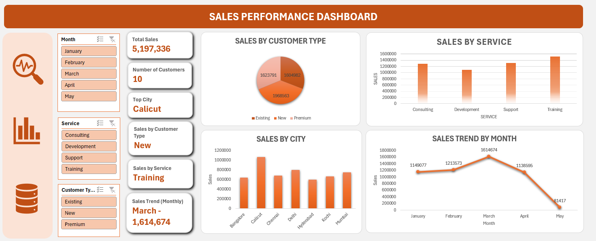

# 📊 Sales Performance Dashboard — Excel

An interactive **Microsoft Excel dashboard** designed to analyze sales performance across customer types, services, cities, and months.

---

## 🎯 Project Overview

This project focuses on analyzing sales data using **Microsoft Excel** and presenting the results through an interactive dashboard.

The dashboard provides a clear overview of sales performance and helps identify trends across:

- Customer types
- Services
- Cities
- Monthly sales
- Overall sales performance

The objective is to use data analysis and visualization to understand sales patterns and identify important business insights from the dataset.

---

## 🛠️ Tools & Technologies

- Microsoft Excel
- Excel Dashboard
- Data Analysis
- Data Visualization
- KPI Design
- Interactive Filtering
- Charts & Graphs

---

## 📌 Key Performance Indicators

| KPI | Description |
|---|---|
| Total Sales | Total sales generated from the dataset |
| Number of Customers | Number of customers included in the analysis |
| Top City | City with the highest sales |
| Top Customer Type | Customer type contributing the highest sales |
| Top Service | Service generating the highest sales |
| Sales Trend | Monthly sales performance |

---

## 📊 Dashboard Features

### 💰 Sales Performance

- Total Sales KPI
- Number of Customers KPI
- Sales by Customer Type
- Sales by Service
- Sales by City
- Monthly Sales Trend

### 👥 Customer Analysis

- Existing customer sales
- New customer sales
- Premium customer sales
- Customer type filtering

### 🏙️ City Analysis

- Sales comparison across cities
- Identification of high-performing cities

### 🛠️ Service Analysis

- Sales by Consulting
- Sales by Development
- Sales by Support
- Sales by Training

### 📅 Monthly Analysis

- January sales
- February sales
- March sales
- April sales
- May sales
- Monthly sales trend visualization

### 🔎 Interactive Filters

- Month
- Service
- Customer Type

---

## 💡 Key Insights

Based on the dashboard analysis:

- **March** records the highest monthly sales in the displayed period.
- **Training** generates the highest sales among the services shown.
- **Calicut** records the highest sales among the displayed cities.
- The dashboard allows comparison of sales across **Existing, New, and Premium** customer types.
- Monthly sales trends help identify periods of stronger and weaker sales performance.
- Interactive filters allow users to explore sales performance by month, service, and customer type.

> **Note:** These insights are based on the available dataset and should be interpreted as observations from the analyzed data.

---

## 🖼️ Dashboard Preview

Add your Excel dashboard screenshot to the repository and name it:

`dashboard preview.png`

Then use:

```markdown

```

---

## 📁 Project Files

- `Sales dashboard.xlsm` — Excel dashboard workbook
- `README.md` — Project documentation
- `dashboard-preview.png` — Dashboard preview image

---

## 🚀 Skills Demonstrated

- Data Analysis
- Data Visualization
- Excel Dashboard Development
- KPI Design
- Interactive Filtering
- Sales Analysis
- Business Insights
- Chart Development
- Dashboard Reporting

---

## 👤 Author

**Your Name**

This project was created as part of an academic data analytics project to demonstrate practical skills in Excel-based data analysis, dashboard development, visualization, and business insight generation.
